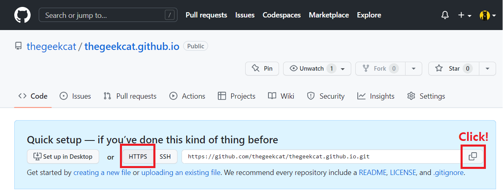

 

<br />

## Issues

The main issue is that earning green squares, so called '🌻**Planting Grass** 🍀', are not added on my GitHub contribution graph even though commits were made!

Since I have made my '**The Geek Cat's Tech Blog**', I pushed commits every day, but there was no any single green square added on the contribution graph excepting the first day when I forked the theme from the Minimal Mistakes repository. 😵

I was very sad and tried to find solutions! 


<br />

<br />

## Reasons

According to '**GitHub Docs**', there are mainly three conditions to plant grass on the contribution graph:

- The email address used for the commits is associated with your account on GitHub.com.
- The commits were made in a standalone repository, not a fork.
- The commits were made:
  - In the repository's default branch
  - In the `gh-pages` branch (for repositories with project sites)

(Reference: [GitHub Docs/Missing contributions](https://docs.github.com/en/account-and-profile/setting-up-and-managing-your-github-profile/managing-contribution-settings-on-your-profile/why-are-my-contributions-not-showing-up-on-my-profile) )

<br />

<br />

## Solutions

I have tried the three steps mentioned in the '**Reasons**' section:

<br />

<br />

### 1. Check the email address in Git

To check the email address, I followed the two sub-steps:

<br />

#### 1.1. Check the 'GitHub Desktop' app

I opened the GitHub Desktop app to check the Email address, and it was okay.


<br />

#### 1.2. Check in Git

I had no doubt that the email address is set correctly as it's already done in the GitHub Desktop app.

However, when I checked the email address, it was not my email address. 😨


Check the current email set in Git:

```powershell
$ git config --global user.email
```


Um.. I was shocked because I trust the GitHub Desktop! 😑

Anyway, set an email address in Git:

```powershell
$ git config --global user.email "MyEmailAddress"
```

<br />

Well, the green squares were still not shown on my profile page even email address was set correctly. 😤

<br /><br />

### 2. Check status of the repository

I'm using the Minimal Mistakes of Jekyll themes for my GitHub blog. (I really appreciate that I can have a chance to use the great theme for my blog!)

So, when I made this blog, I forked the theme to set up a new blog. 

<br />

#### 2.1. Rename the current repository

The current repository using for the blog is forked from the repository of Minimal Mistakes.

So, the current repository is put as an old one to avoid confusion and it'll be cloned to a new repository.


<br />

#### 2.2. Check the web URL of the old repository

Copy the web URL of the old repository to clone it.


<br />

#### 2.3. Clone the old repository with `--mirror` option on local

Open Git Bash to clone the old repository with `--mirror` option on local drive. The  reason of using `--mirror` option is to clone all histories of commits to a new repository. 

```powershell
$ git clone --mirror https://github.com/YOUR-USERNAME/YOUR-OLD-REPOSITORY-NAME
```

Change the working directory to the location where the old repository is.

```powershell
$ cd OLD-REPOSITORY-NAME.git
```

(*Note*: Please keep the Git Bash for later)


<br />

#### 2.4. Create a new depository

Create a new repository to clone the old depository:

(*Note*: You can directly name the new repository as your blog name)


<br />

#### 2.5. Copy the web URL of the new repository

You can click the button '**Set up in Desktop**' to set up on GitHub Desktop which is much easier way;

however, I tried another way to use the Git Bash.

So, copy the web URL in Settings of the new repository like below:



<br />

#### 2.6. Push contents of old repository to the new repository

Go back to Git Bash which is already opened in the section 2.3 above. 

Push all directories and files from old repository to the new repository with `--mirror` option.

```powershell
$ git push --mirror https://github.com/YOUR-USERNAME/YOUR-NEW-REPOSITORY-NAME
```


<br /><br /><br />

Tada! So now you can see planning grass is done!!


